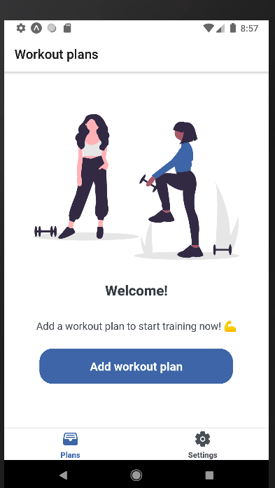
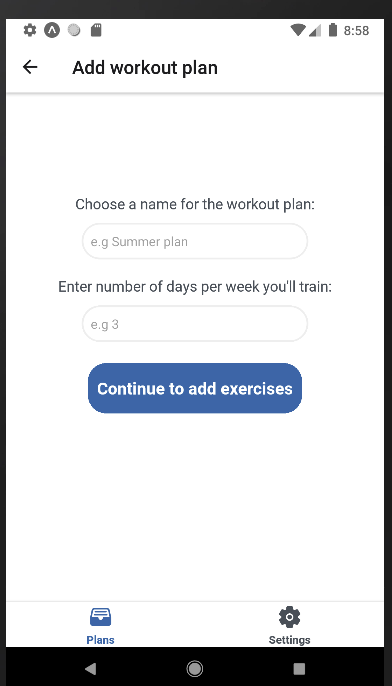
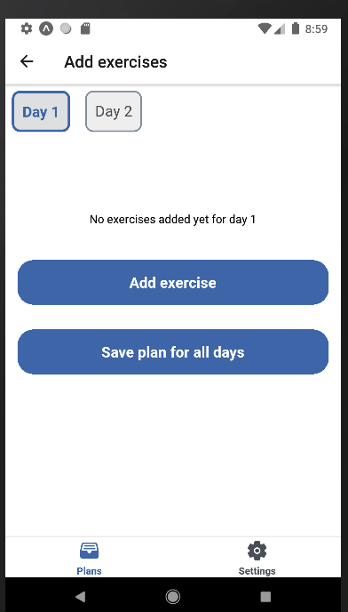
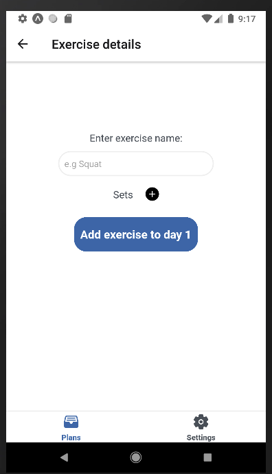
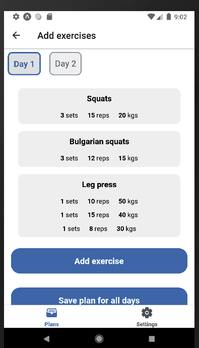
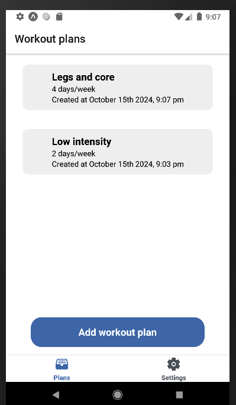
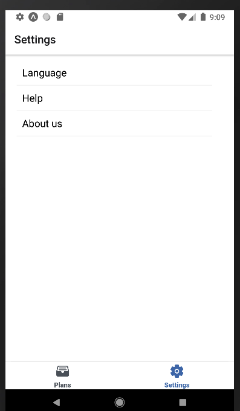

# Table of contents:
- [Table of contents:](#table-of-contents)
  - [Minimum requirements ](#minimum-requirements-)
  - [Installation ](#installation-)
  - [Execution ](#execution-)
  - [Run tests ](#run-tests-)
  - [Screenshots ](#screenshots-)

## Minimum requirements <a name="minimum-requirements-"></a>
  - Node 18.5
  - XCode 14 (if you build for iOS)
  - Android studio (if you build for Android)

## Installation <a name="installation-"></a>

Install dependencies:

```
$ yarn
```

## Execution <a name="execution-"></a>

```
$ npx expo start
```

You'll see a screen like the one below. Follow the instructions and choose where you'd like to execute the app. 

If you select iOS or Android, the respective simulator should be already up and running. For iOS use Xcode, and for Android you can use the ADV Manager from Android Studio.

```
▄▄▄▄▄▄▄▄▄▄▄▄▄▄▄▄▄▄▄▄▄▄▄▄▄▄▄
█ ▄▄▄▄▄ █▄▄███▀ █▀█ ▄▄▄▄▄ █
█ █   █ █ ▀█ ▄ ▄▀ █ █   █ █
█ █▄▄▄█ █▄ ▄▄▀▀█▄▀█ █▄▄▄█ █
█▄▄▄▄▄▄▄█▄▀▄▀▄█▄▀ █▄▄▄▄▄▄▄█
█ ▄  █▀▄█ ▀███▀▀▄▄▄██▄ ▄▀▄█
█▄ ▀█▀▄▄ ▀██▀▀ ▄█ █ ▀██▀███
██▀ ▀▄█▄ ▀▄▀ █ █ ▄█ ▄ █ █▀█
█▀▄▄▄▄▀▄▄▄▀▀█ ▄██ ▀▀█▀▀█ ▀█
███▄▄██▄▄▀ █▄▀  ▄ ▄▄▄ ▀▄█▀█
█ ▄▄▄▄▄ ████▄ █▀█ █▄█ █▄ ▄█
█ █   █ █▀▄▄▄▀▀▀▀▄▄   █▀▀ █
█ █▄▄▄█ █  ▀▄▄▀▄▀▄▀▄█▄▄ ▄██
█▄▄▄▄▄▄▄█▄▄███▄█▄██████▄▄▄█

› Metro waiting on exp://192.168.1.131:8081
› Scan the QR code above with Expo Go (Android) or the Camera app (iOS)

› Web is waiting on http://localhost:8081

› Using Expo Go
› Press s │ switch to development build

› Press a │ open Android
› Press i │ open iOS simulator
› Press w │ open web

› Press j │ open debugger
› Press r │ reload app
› Press m │ toggle menu
› Press o │ open project code in your editor

› Press ? │ show all commands

Logs for your project will appear below. Press Ctrl+C to exit.
```

## Run tests <a name="run-tests-"></a>

```
$ yarn test
```
Every push or new pull request into the remote repository triggers a Github action that will also run the tests automatically.

**How to update test snapshots**

```
$ yarn test -u
```

## Screenshots <a name="screenshots-"></a>

The look and feel is in progress ❤️

Check out how it looks right now!







